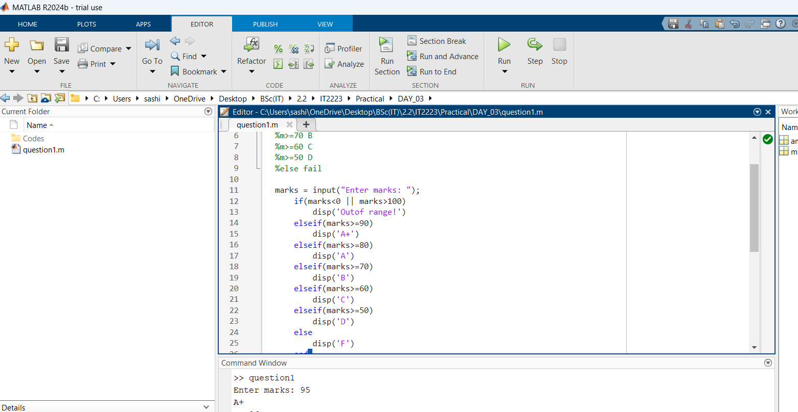
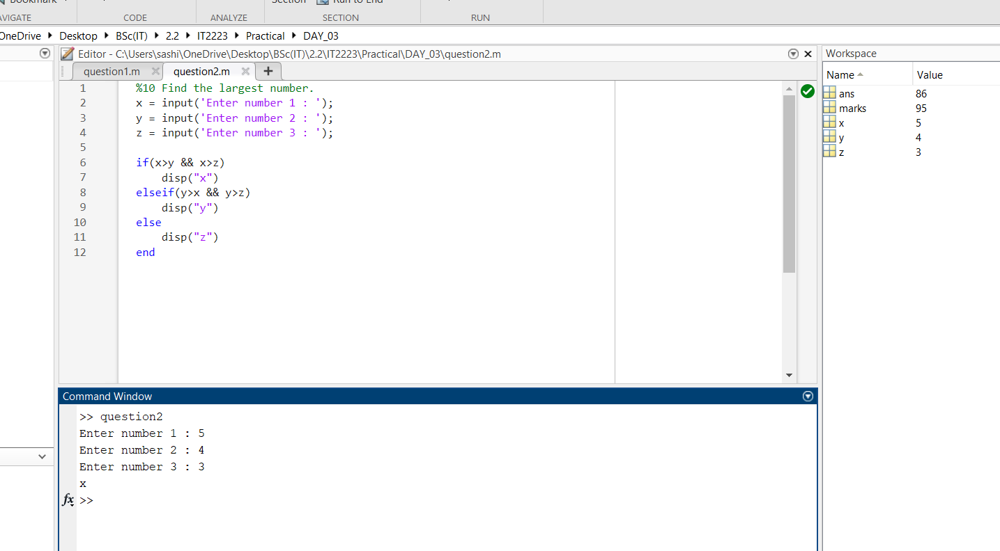
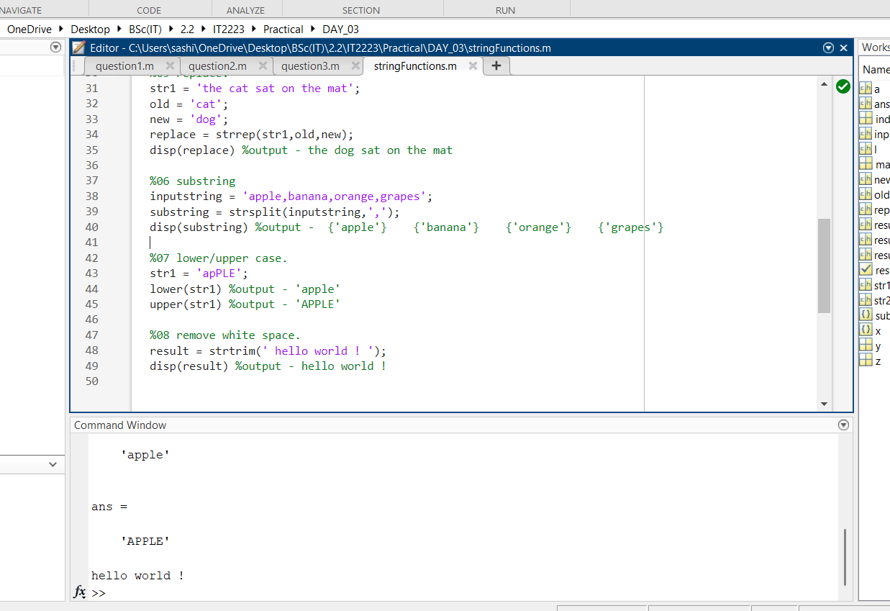

| Codes | Output |
|-------|--------|
|['question1.m'](./Codes/question1.m)||
|['question2.m'](./Codes/question2.m)||
|['question3.m'](./Codes/question3.m)||
|['stringFunctions.m'](./Codes/stringFunctions.m)||
