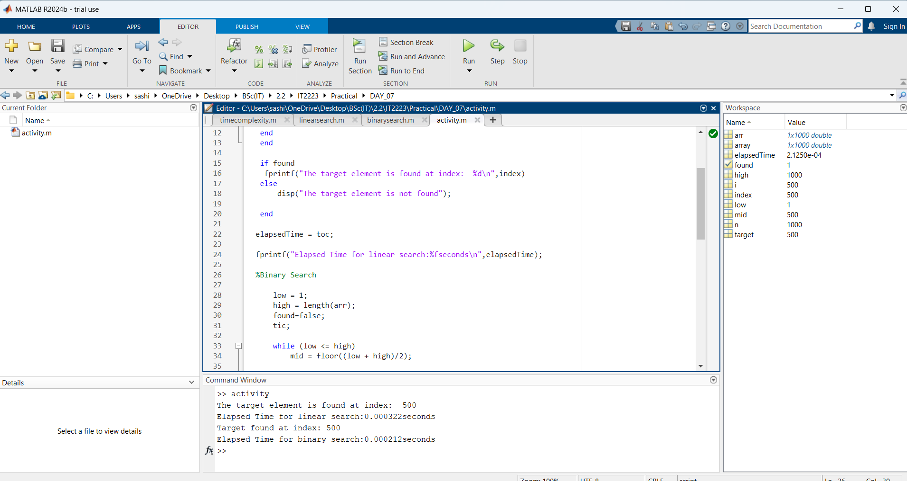

| Codes | Outputs |
|-------|--------|
|['activity.m'](./Codes/activity.m)||

// 🔎 **Linear Search**

✅ The target element is found at index: `500`  
⏱️ Elapsed Time: `0.000322 seconds`

// 🔍 **Binary Search**

✅ Target found at index: `500`  
⏱️ Elapsed Time: `0.000212 seconds`

---

## ⚖️ **Comparison Result**

📌 **In this case, binary search is faster than linear search.**

### 📈 Performance Insights:

- 🔢 **Target Index:** Both found the element at index `500`.
- 🕒 **Execution Time:**
  - Binary Search: `0.000212s` ⚡
  - Linear Search: `0.000322s` 🐢

### 📊 Conclusion:

- ✅ **Binary search** performs better for larger datasets, especially when the data is **sorted**.
- ⚠️ **Linear search** checks each element one by one, making it slower as the index increases.

---

🧠 **Tip:**  
Choose **binary search** for faster performance when working with **sorted** data and large collections.  
Use **linear search** only for **unsorted** or very **small datasets**.
