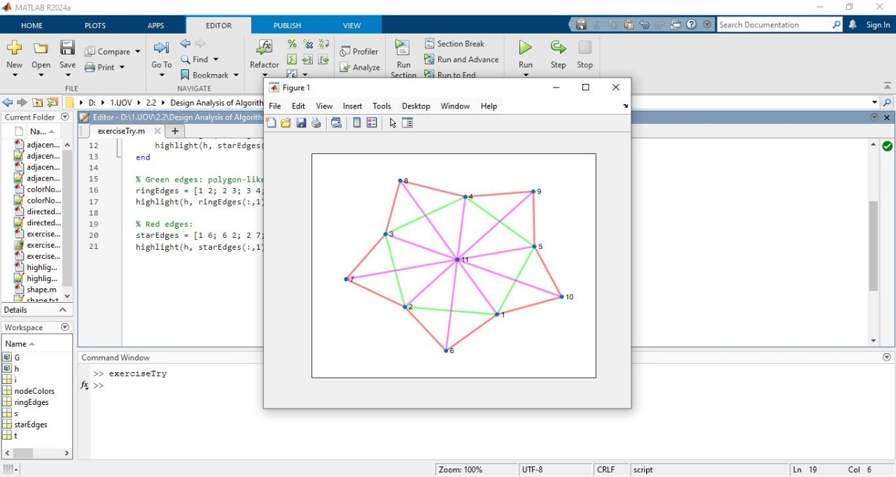
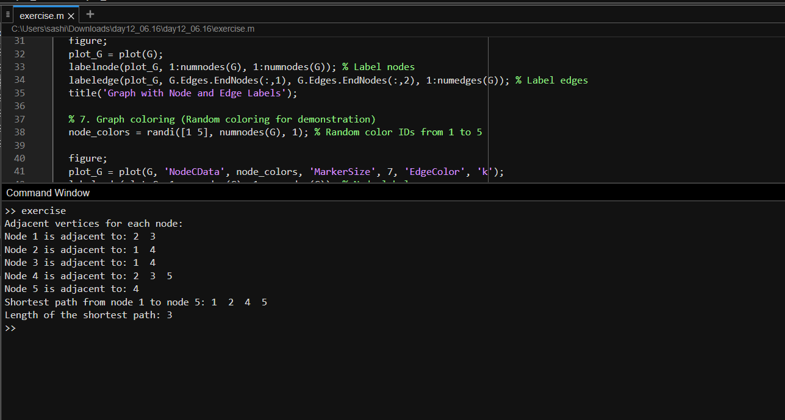
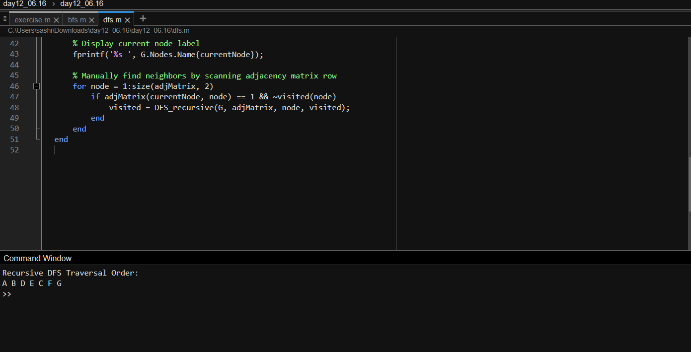
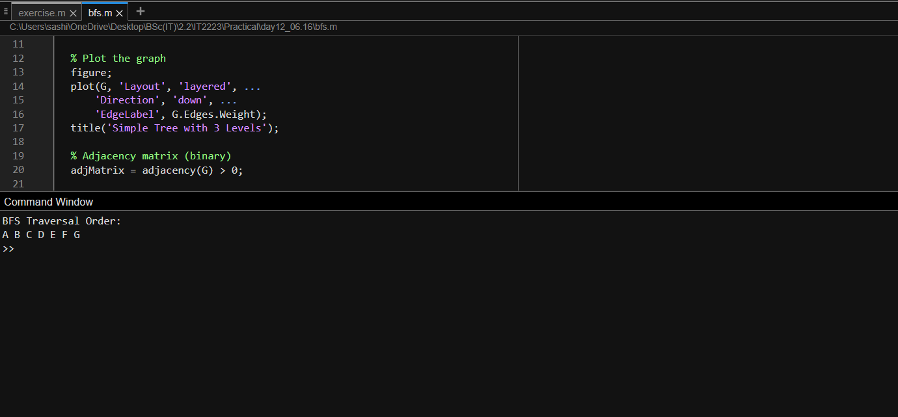
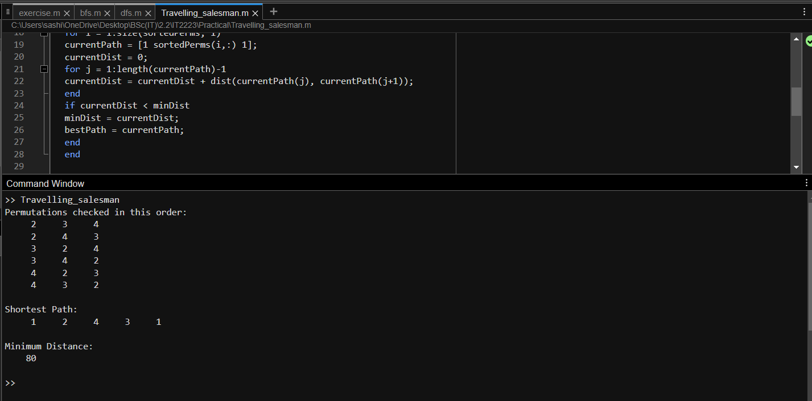
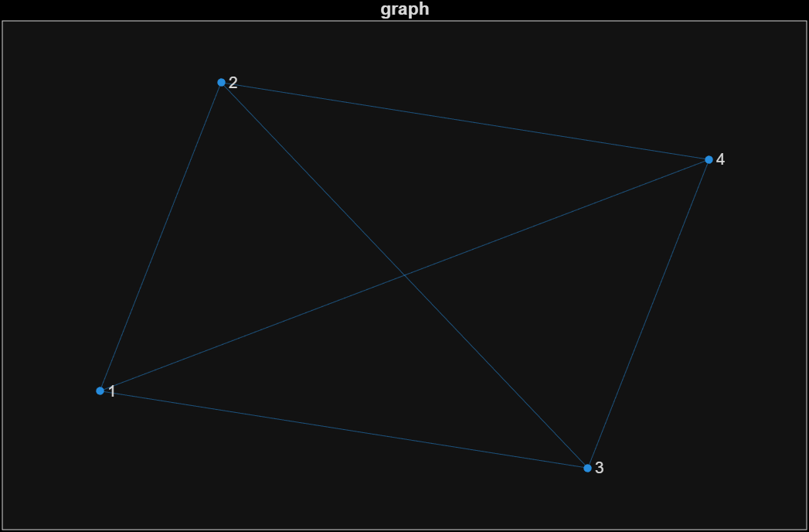
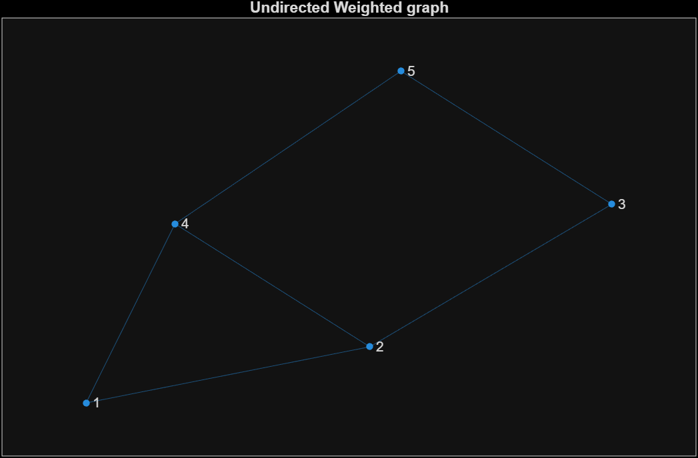
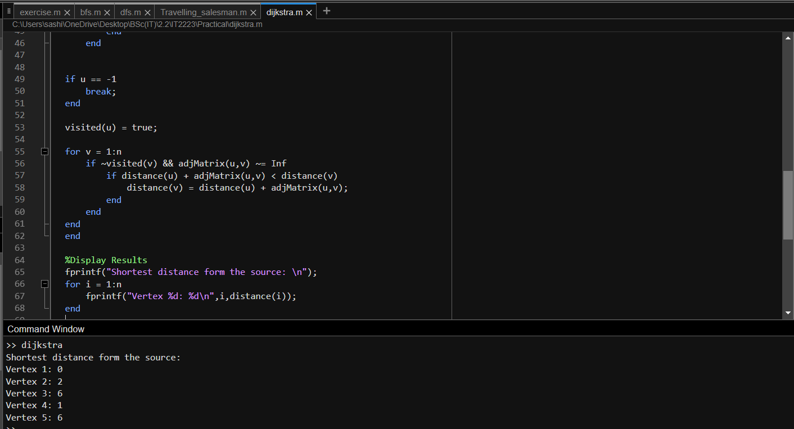

| Codes | Output |
|-------|--------|
|['adjacency.m'](./Codes/adjacency.m)||
|['Exercise.m'](./Codes/Exercise.m)||
|['exercise.m'](./Codes/exercise.m)||
|['dfs.m'](./Codes/dfs.m)||
|['bfs.m'](./Codes/bfs.m)||
|['Travelling_salesman.m'](./Codes/Travelling_salesman.m)||
|['dijkstra.m'](./Codes/dijkstra.m)||
