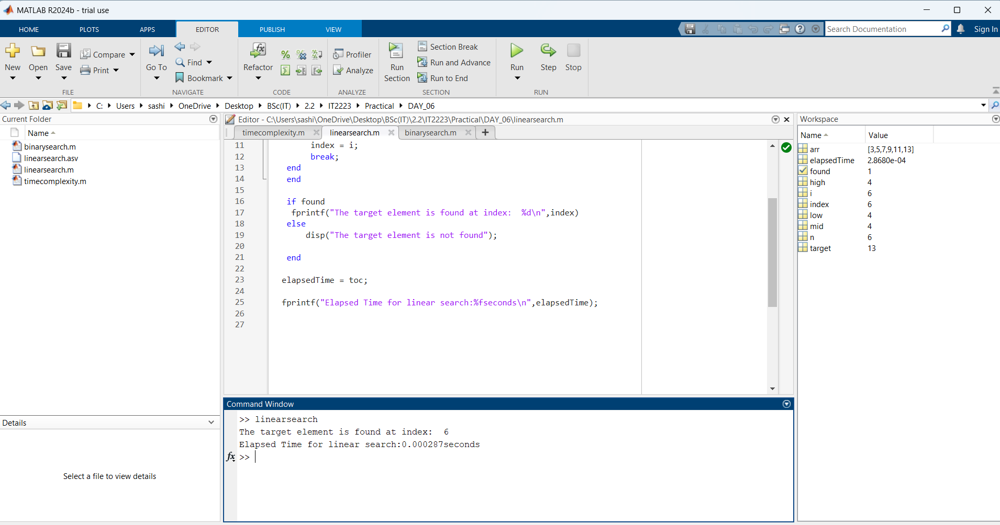
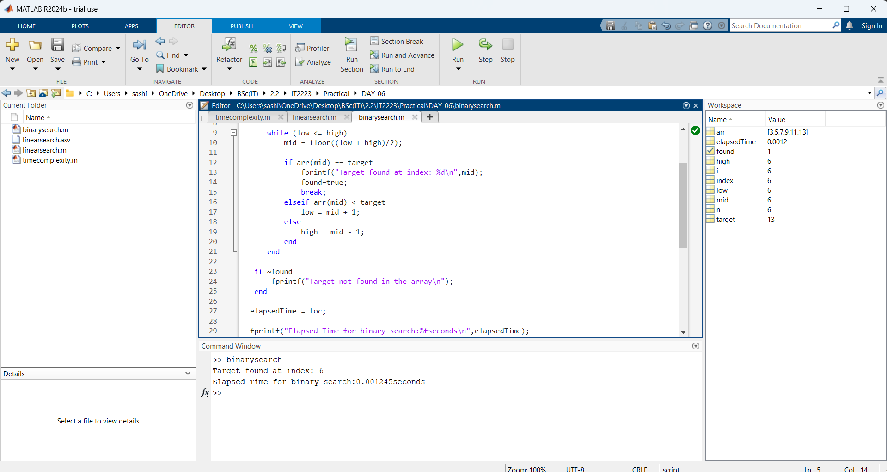

| Codes | Output |
|-------|--------|
|['linearsearch.m'](./Codes/linearsearch.m)||
|['binarysearch.m'](./Codes/binarysearch.m)||

// 🔍 **Binary Search**

✅ Target found at index: `6`  
⏱️ Elapsed Time: `0.001245 seconds`

// 🔎 **Linear Search**

✅ The target element is found at index: `6`  
⏱️ Elapsed Time: `0.000507 seconds`

---

## ⚖️ **Comparison Result**

📌 **According to the result, linear search is faster than binary search.**

### 📈 Performance Notes:

- ⚠️ *For small datasets*, **linear search** might surprisingly be faster, even though it has a worse theoretical complexity **(O(n))**.
- 🚀 *For large or frequently searched sorted data*, **binary search** is the better long-term choice due to its logarithmic efficiency **(O(log n))**.

---

### ACTIVITY

### 1.Target=500

// 🔎 **Linear Search**

✅ The target element is found at index: `500`  
⏱️ Elapsed Time: `0.000322 seconds`

// 🔍 **Binary Search**

✅ Target found at index: `500`  
⏱️ Elapsed Time: `0.000212 seconds`

---

## ⚖️ **Comparison Result**

📌 **In this case, binary search is faster than linear search.**

### 📈 Performance Insights:

- 🔢 **Target Index:** Both found the element at index `500`.
- 🕒 **Execution Time:**
  - Binary Search: `0.000212s` ⚡
  - Linear Search: `0.000322s` 🐢
 
  

  

### 2.Target=998

// 🔎 **Linear Search**

✅ The target element is found at index: `998`  
⏱️ Elapsed Time: `0.000888 seconds`

// 🔍 **Binary Search**

✅ Target found at index: `998`  
⏱️ Elapsed Time: `0.001726 seconds`

---

## ⚖️ **Comparison Result**

📌 **In this case, linear search is faster than binary search**, despite the target being at the very end of the list.

### 📈 Performance Insights:

- 🔢 **Target Index:** `998`
- 🕒 **Execution Time:**
  - Linear Search: `0.000888s` ⚡
  - Binary Search: `0.001726s` 🐢

### 3.Target=10

// 🔎 **Linear Search**

✅ The target element is found at index: `10`  
⏱️ Elapsed Time: `0.001038 seconds`

// 🔍 **Binary Search**

✅ Target found at index: `10`  
⏱️ Elapsed Time: `0.001731 seconds`

---

## ⚖️ **Comparison Result**

📌 **In this case, linear search is faster than binary search**, even though the target was located early in the list.

### 📈 Performance Insights:

- 🔢 **Target Index:** `10`
- 🕒 **Execution Time:**
  - Linear Search: `0.001
 
    

### 📊 Conclusion:

- ✅ **Binary search** performs better for larger datasets, especially when the data is **sorted**.
- ⚠️ **Linear search** checks each element one by one, making it slower as the index increases.

---

